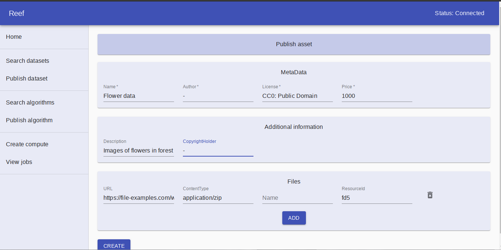
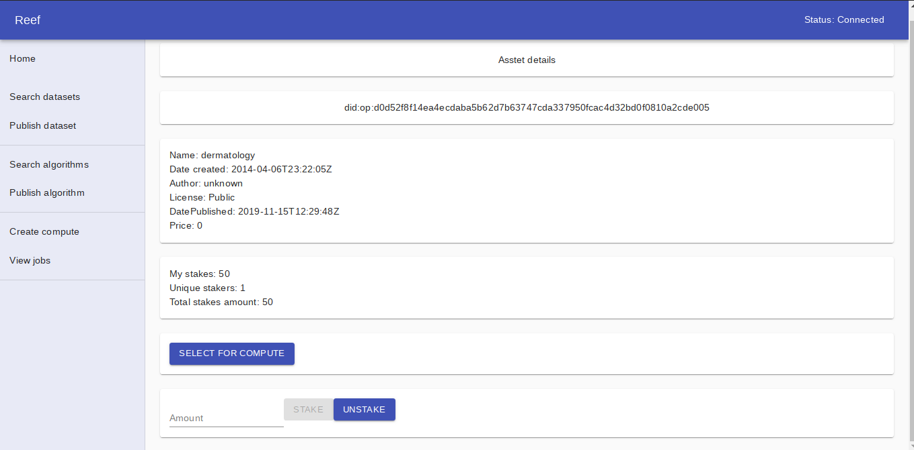

# Reef - (Algorank and staking on Ocean assets)

### User can

    1. Search for published datasets/algorithms
    2. Publish dataset/algorithms
    3. Add stakes on dataset/algorithms.
    4. Unstake the stakes.
    5. Run compute jobs.
    6. View compute job status.

### Change config

To change the ocean network and contract addresses, uris please check: `src/config.ts`

### `npm start`

Runs the app in the development mode conntected to Ocean Nile network.
Open [http://localhost:3006](http://localhost:3006) to view it in the browser.

### Ranking

Two variables considered for staking:

    1. Total amount of staked ocean tokens
    2. Count of unique accounts who have added stakes.

### Staking contract

Link: [Staking ](https://github.com/akshay-ap/StakeToken)

### Deployment

1. Deploy the Staking contract. [See the steps mentioned here](https://github.com/akshay-ap/StakeToken)

2. Replace the [STAKE_APP_CONTRACT_ADDRESS](https://github.com/akshay-ap/reef/blob/40f71d87d3f6af3faab51cf7f1c6b03695eed6eb/src/config.ts#L21) in `src/confing.ts`

3. Replace the [OCEAN_TOKEN_CONTRACT_ADDRESS](https://github.com/akshay-ap/reef/blob/40f71d87d3f6af3faab51cf7f1c6b03695eed6eb/src/config.ts#L22)

4. Change Ocean network related config [Link](https://github.com/akshay-ap/reef/blob/master/src/config.ts).

### Ranking logic

    The `StakeApp` contract stores the stakes users (ERC20 tokens). The application decides the rank of the alogrithm/dataset based on 2 factors: 
        a. Total stakes of ERC20 tokens on each asset (dataset/algorithm).
        b. Count of unique user addresses who have staked the tokens on each asset.
    Equal weight is given to both the above two factors and the score for each `algorithm`/`dataset` is calculated. The assets are ranked from highest to lowest score.

    Formula:
    1. Normalize the list of count of unique addresses who have staked on assets.
    2. Normalize the list of amount of stakes on assets.
    3. Calculate the average of above two list.

    e.g.

#### Input

| Asset_ID | Count of unique addresses who added stakes | Total amount staked |
|----------|--------------------------------------------|---------------------|
| A        | 4                                          | 40000               |
| B        | 10                                         | 35000               |
| C        | 2                                          | 500000              |

#### Result

| Asset_ID | Normalized Score of Count of addresses | Total amount staked | Average | Rank |
|----------|----------------------------------------|---------------------|---------|------|
| A        | 0.25                                   | 0.010752688         | 0.13037 | 2    |
| B        | 1                                      | 0                   | 0.5     | 1    |
| C        | 0                                      | 1                   | 0.5     | 1    |

### Demo images

1. View datasets:
    

2. Publish asset:
    

3. View asset:
    

4. Create compute job:
    

### To do

1. Add loading bar in whole application.

2. Fix `view Jobs`.

3. Improve compute-to-data feature.

4. Add more factors for ranking.
