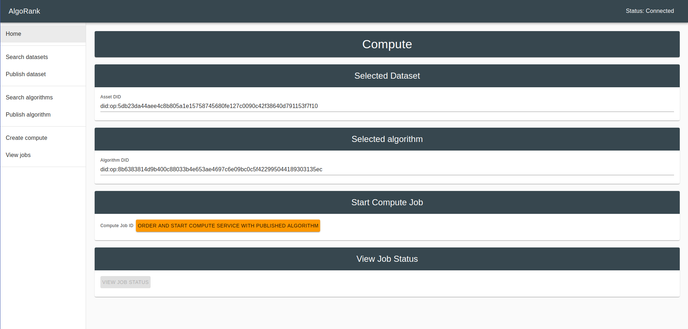

# Reef - (Algorank and staking on Ocean assets)

### User can

    1. Search for published datasets/algorithms
    2. Publish dataset/algorithms
    3. Add stakes on dataset/algorithms.
    4. Unstake the stakes.
    5. Run compute jobs.
    6. View compute job status.

### Change config

To change the ocean network and contract addresses, uris please check: `src/config.ts`

### `npm start`

Runs the app in the development mode conntected to Ocean Nile network.
Open [http://localhost:3006](http://localhost:3006) to view it in the browser.

### Ranking

Two variables considered for staking:

    1. Total amount of staked ocean tokens
    2. Count of unique accounts who have added stakes.

### Staking contract

Link: [Staking ](https://github.com/akshay-ap/StakeToken)

### Deployment

1. Deploy the Staking contract. [See the steps mentioned here](https://github.com/akshay-ap/StakeToken)

2. Replace the [STAKE_APP_CONTRACT_ADDRESS](https://github.com/akshay-ap/reef/blob/40f71d87d3f6af3faab51cf7f1c6b03695eed6eb/src/config.ts#L21) in `src/confing.ts`

3. Replace the [OCEAN_TOKEN_CONTRACT_ADDRESS](https://github.com/akshay-ap/reef/blob/40f71d87d3f6af3faab51cf7f1c6b03695eed6eb/src/config.ts#L22)

4. Change Ocean network related config [Link](https://github.com/akshay-ap/reef/blob/master/src/config.ts).

### Demo images

1. View datasets:
    

2. Publish asset:
    

3. View asset:
    

4. Create compute job:
    
